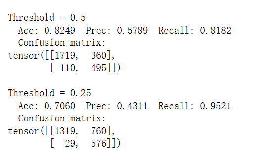
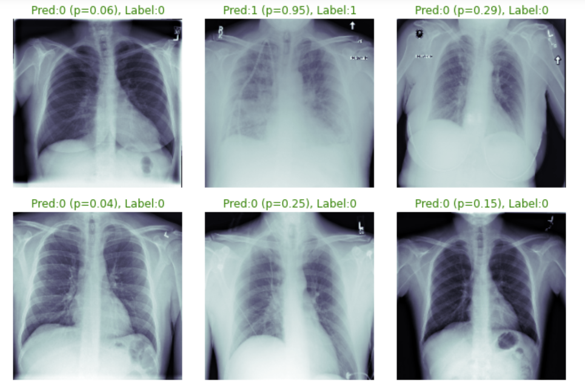
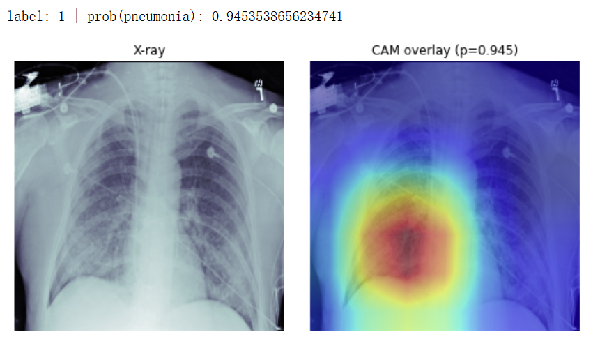

# 🫁 Pneumonia Classification from Chest X-Ray

This repository contains a deep learning pipeline for classifying pneumonia from chest X-ray images. The model was trained and evaluated on the **RSNA Pneumonia Detection Challenge dataset** from Kaggle.

---

## 📌 Dataset

This project uses the **RSNA Pneumonia Detection Challenge** dataset:

🔗 https://www.kaggle.com/c/rsna-pneumonia-detection-challenge/data

### About the dataset

- **Modality:** Chest X-ray images (DICOM)
- **Task:** Detect pneumonia in frontal chest X-rays
- The dataset provides:
  - `train_images/` — training chest X-ray DICOM files
  - `test_images/` — test DICOM files
  - `train_labels.csv` — bounding box and label annotations
  - Metadata indicating whether a study has pneumonia
- This project uses the provided labels to create a **binary classification task** (pneumonia vs normal).

---

## 💡 Project Overview

- **Task:** Binary classification (Pneumonia / Normal)
- **Input:** Preprocessed chest X-ray images resized to 224×224
- **Model:** Modified ResNet-18 with a single input channel
- **Frameworks:** PyTorch, PyTorch Lightning
- **Metrics:** AUROC, Accuracy, Precision, Recall, Confusion Matrix
- **Explainability:** Grad-CAM visualization

---

## 🧠 Model Architecture

- **Backbone:** ResNet-18 (ImageNet pretrained)
- **Modification:** First convolution changed to accept single-channel (grayscale) X-rays
- **Output:** 1 logit → sigmoid output for pneumonia probability
- **Loss:** Binary Cross-Entropy with logits (with `pos_weight` for class imbalance)
- **Optimization:** Adam optimizer

---

## 📊 Quantitative Results
Validation AUROC: 0.913

Lowering the threshold increases recall — desirable for screening scenarios where missing positive cases is costly.

---

## 🖼️ Qualitative Results

### 🧪 Model Predictions on Validation Set

Below is a grid of sample predictions showing:
- Model prediction (Pred)
- Predicted probability (p)
- Ground truth label (Label)

Green text indicates correct predictions; red text indicates incorrect predictions.

---

## 🔍 Interpretability (Grad-CAM)

To understand what the model sees, Grad-CAM visualizations highlight regions that contributed most to the prediction.

Below is an example of a **true positive** pneumonia case:

- Ground truth: Pneumonia
- Model probability: `p = 0.945`
- Activation focuses on clinically plausible lung regions

This suggests the model is localizing meaningful features related to pneumonia.

---

## ⚠️ Error Analysis

- **False positives** may occur on images with radiographic abnormalities (e.g., atelectasis, devices, lines) that resemble pneumonia patterns.
- **False negatives** often correspond to subtle or early-stage cases with weak radiographic signs.

This reflects a known limitation of chest X-ray diagnosis and highlights the importance of threshold choice and model interpretability.

---
## 🧪 How to Reproduce

1. Download and unpack the RSNA dataset from Kaggle.
2. Preprocess images using `preprocess.ipynb`.
3. Train the model with `train.ipynb`.
4. Analyze predictions and Grad-CAM with `interpretability.ipynb`.

## 📬 Notes

This project is intended to demonstrate practical experience with deep learning and medical imaging, and is **not a clinical diagnostic tool**.

